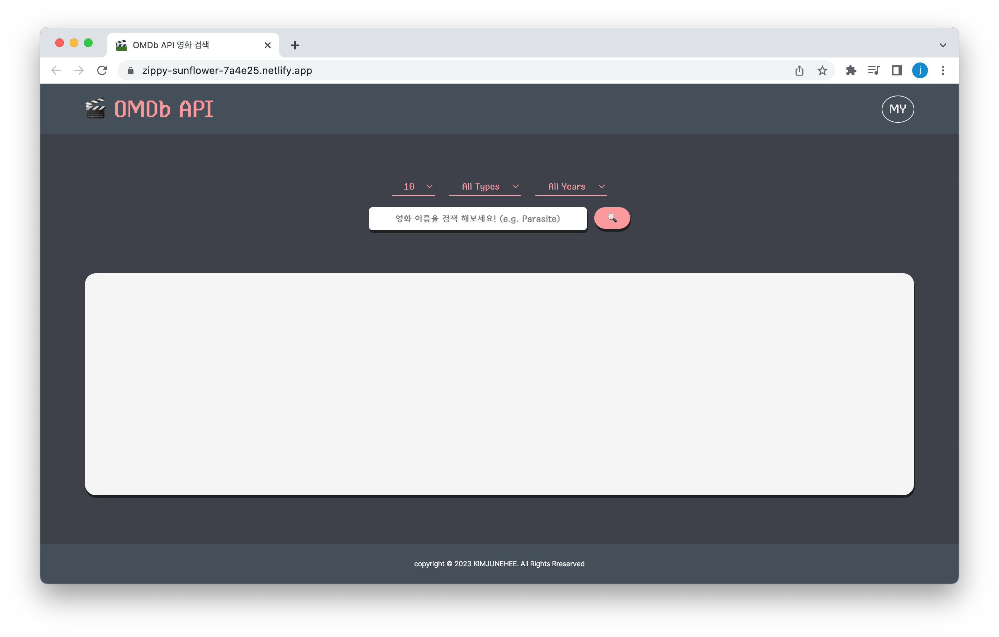
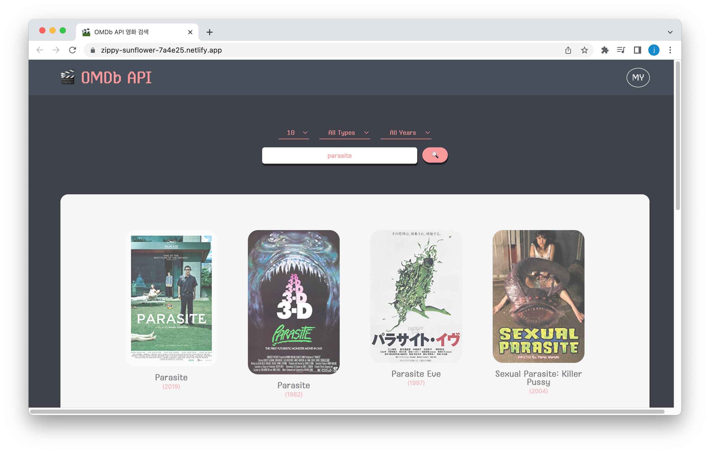
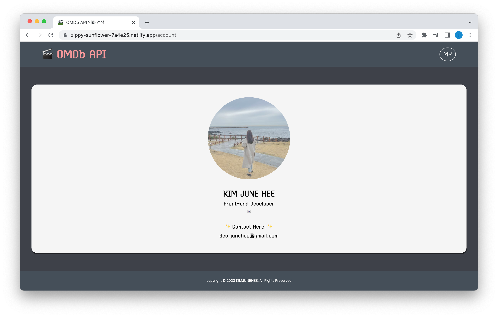

# 🎬 OMDb API 영화 검색
[OMDb API](https://www.omdbapi.com/)를 활용하여 영화 검색 페이지를 구현하였습니다.

 

## 프로젝트 소개
> **패스트캠퍼스 프론트엔드 개발 부트캠프 5기** 
**개발 기간** : 2023. 04. 20 ~ 2023. 05. 05 
**배포 주소** : [DEMO](https://omdb-api-movie-search.netlify.app/)

 

## 화면 구성

## 개발자 소개
|김준희|
|:---:|
||
|[@dev-junehee](https://github.com/dev-junehee)|

 

## 사용기술 및 개발환경

</a>
</a>
</a>
</a>
</a>
 
</a>
</a>
</a>
</a>

  

## 구현 내용 (과제 요구사항)
### ❗ 필수

- [x] 영화 제목으로 검색이 가능해야 합니다!
- [x] 검색된 결과의 영화 목록이 출력돼야 합니다!
- [x] 실제 서비스로 배포하고 접근 가능한 링크를 추가해야 합니다.
- [x] 차별화가 가능하도록 프로젝트를 최대한 예쁘게 만들어보세요.

### 아쉬운 점
- 영화 포스터 클릭 시 모달창과 해당 영화의 데이터를 연결하지 못함
- Sass(SCSS) 및 Styled-Components 제대로 활용하지 못함
- Components 분리 및 관리를 잘 하지 못함
- React를 제대로 이해하고 사용하지 못하여 다양한 기능을 구현하지 못함